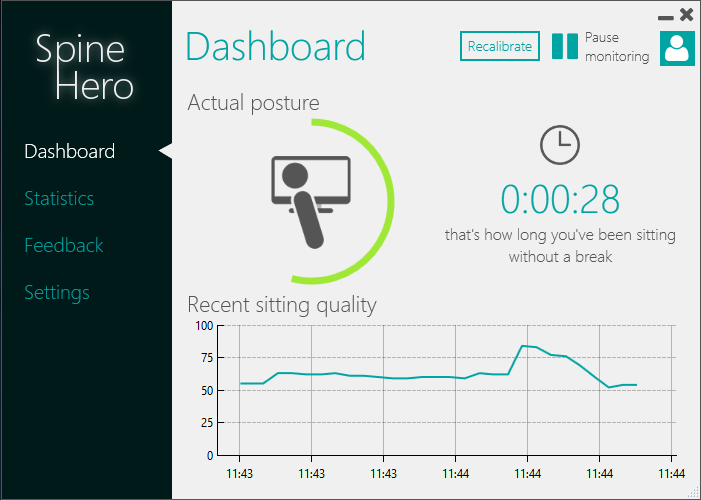

# Spine-Hero
Spine Hero tracks your posture via web (or depth) camera. When you sit wrongly, it notifies you in the least disturbing way.

Getting started
---------------
1. Clone repository
2. Download and install Microsoft Build Tools 2017
	https://www.visualstudio.com/thank-you-downloading-visual-studio/?sku=BuildTools&rel=15
3. Download and install Visual Studio Community
4. Open solution in Visual Studio and run/debug it
5. When PostSharp starts, select free version (Postsharp Express) to install

Creating installer
------------------
1. Download and install Inno Setup
2. Download and install Inno Script Studio
3. Download and install Inno Download Plugin
4. Download and install Windows SDK because of SignTool (maybe it's already installed)
